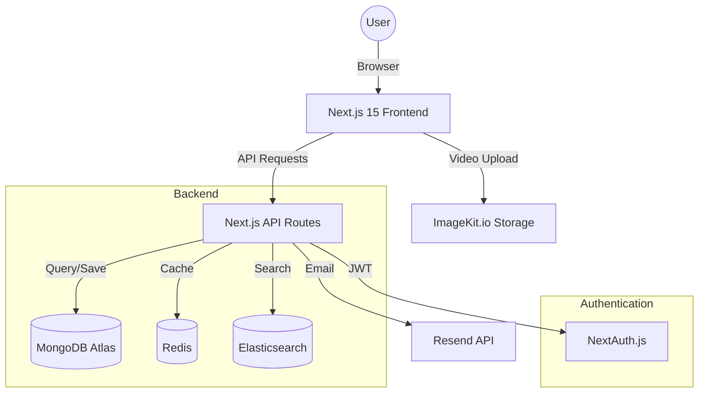

# Reels Pro Platform - Detailed Presentation Guide

This document provides a deep-dive into the technical and functional aspects of the Reels Pro Platform, structured specifically for a full academic or professional presentation.

---

## 1. System Architecture

The application follows a **Decoupled Architecture** where the frontend handles user interactions and the backend (Serverless API) manages data persistence and external integrations.

---

## 2. Technical Stack Deep-Dive

### **Frontend Excellence**

- **Next.js 15 (App Router)**: Utilizing Server Components for SEO and Client Components for interactivity.
- **HeroUI & Tailwind CSS 4**: A modern design system that ensures a premium, high-fidelity UI/UX.
- **Framer Motion**: Powering smooth transitions between reels and micro-interactions.

### **Robust Backend**

- **MongoDB & Mongoose**: Flexible document-oriented storage for complex video and user relations.
- **Redis Integration**: Planned for caching frequently accessed video feeds to reduce database load.
- **Elasticsearch**: Implementation focus on high-speed user and content discovery.

### **Media Orchestration**

- **ImageKit.io**: Critical for short-form video. It handles:
  - **Real-time Transcoding**: Converts videos to various formats (mp4, webm).
  - **Smart Cropping**: Ensures videos fit the 1080x1920 mobile viewport.
  - **Global CDN**: Delivers content with low latency.

---

## 3. Detailed Component Breakdown

### **Project Structure (What's Where?)**

- `app/`: Contains all routes and layouts.
  - `api/`: Serverless logic for auth, videos, and interactions.
  - `feed/`: The core video scrolling experience.
  - `profile/`: User-specific dashboard and settings.
  - `upload/`: The content creation interface.
- `components/`: Reusable UI elements (FeedCard, Navbar, UploadForm).
- `models/`: Mongoose schemas defining the data structure.
- `lib/`: Utility functions, database connection, and third-party API configurations.

---

## 4. Primary Data Flows

### **A. Secure Authentication Flow**

1. User enters credentials.
2. `NextAuth` triggers the `authorize` callback.
3. Password verified via `bcrypt`.
4. JWT session created.
5. `middleware.ts` intercepts requests to ensure only authenticated users can access `/upload` or `/edit-profile`.

### **B. Video Lifecycle**

1. **Creation**: Client fetches auth tokens -> Uploads to ImageKit -> Saves metadata to MongoDB.
2. **Consumption**: `GET /api/videos` fetches the latest public reels with pagination.
3. **Engagement**: Users can `Like` or `Bookmark`, triggering atomic updates ($addToSet/$pull) in MongoDB to ensure data integrity.

---

## 5. Performance & Optimization

- **Optimistic UI**: Likes and bookmarks update instantly on the UI while the API request processes in the background.
- **Image/Video Optimization**: ImageKit's `transformation` parameters ensure users only download the quality they need based on their device.
- **Database Pagination**: Utilizing `.skip()` and `.limit()` to ensure fast load times even with thousands of videos.
- **Security**: Environment variables (`.env`) protect sensitive API keys (ImageKit, MongoDB, NextAuth Secret).

---

## 6. Challenges & Solutions

| Challenge                     | Solution                                                                            |
| :---------------------------- | :---------------------------------------------------------------------------------- |
| **Video Processing Overhead** | Offloaded to ImageKit to avoid taxing our own server resources.                     |
| **Mobile-First Video Fit**    | Used strict dimension constants (1080x1920) and CSS `object-cover`.                 |
| **State Synchronization**     | Used React Context and Next.js `revalidatePath` to keep the UI in sync with the DB. |

---

## 7. Future Roadmap

1. **Real-time Notifications**: Using WebSockets (Socket.io) for instant interaction alerts.
2. **AI Content Tagging**: Integrating AI to automatically tag videos based on content.
3. **Advanced Analytics**: A dashboard for creators to see video performance.

---

> [!IMPORTANT]
> This document is designed to be the "Speaker Notes" or "Content Source" for your presentation. Each section corresponds to 1-2 slides.
